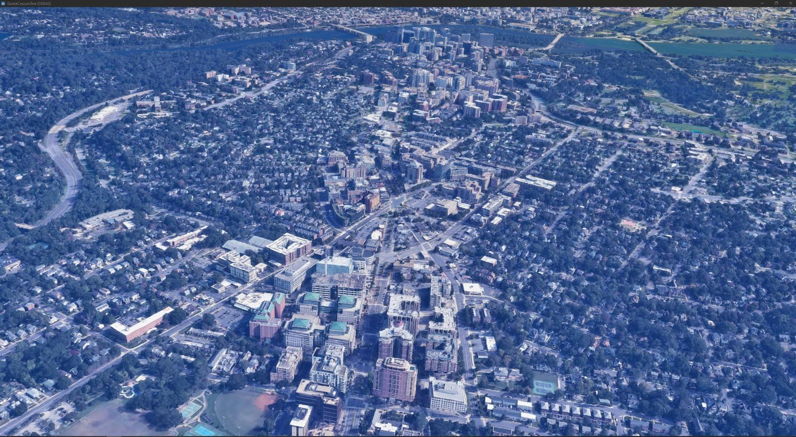

# Cesium Godot 3D Tiles Plugin

A Godot 4 extension that integrates Cesium 3D Tiles capabilities into Godot Engine through GDExtension.



## Prerequisites

- **Windows 10/11** (64-bit)
- **Python 3.8+** (with pip)
- **SCons** (`pip install scons`)
- **Visual Studio 2022** with C++ desktop development workload (If you plan on contributing or developing)
- **Git**
- **Godot 4.1+** (with GDExtension support)

## Installation (as GDExtension)

### 1. Clone the Repository
```bash
git clone https://github.com/Battle-Road/3D-Tiles-For-Godot.git
cd 3D-Tiles-For-Godot
```

If you would like to build the binaries and you don't plan on modifying the underlying C++ code with any editor use the following command
`scons platform=windows arch=x64 compileTarget=extension`

Otherwise, to get a `compile_commands.json` file to use with an IDE or Text Editor, run
`scons platform=windows compiledb=true arch=x64 compileTarget=extension debug_symbols=true`

#### Build Flags Explained:

* `platform=windows`: Build for Windows (currently only supported platform)

* `compiledb=true`: Generate IDE-friendly compilation database (optional)

* `arch=x64`: 64-bit architecture, will be used as build architecture for all subsequent libraries 

* `compileTarget=extension`: Build as GDExtension

* `debug_symbols=yes`: Include debug information (use no for release)

**The build binaries will be at `godot3dtiles/bin/Godot3DTiles.windows.template_debug.x86_64.dll`**


## Setting Up a Project
### Create New Godot Project

* Use Godot 4.1 or newer

* Choose "Forward+" renderer in project settings

### Copy Plugin Files

* From the repository:

  * Copy `godot3dtiles/bin/` folder to your project root

  * Copy `godot3dtiles/addons/` folder to your project root

Your project structure should look like:

```
my_project/
├── addons/
│   └── cesium_godot/
│       ├── panels/
│       ├── scripts/
│       └── visuals/
├── bin/
└── project.godot
```

Alternatively, you can choose to create a new project using the `godot3dtiles/` folder as the project's root

### Enable the plugin

* Open your project in Godot

* Go to Project → Project Settings → Plugins

* Enable "cesium_godot"

## Getting Started

### Using the Cesium Panel

The Cesium Panel provides some utilities for you to quickly be able to describe and navigate your way around the plugin

**Connect to Cesium ION**

#### Note: This plugin is currently Windows-only. Linux/MacOS support is planned for future releases.

